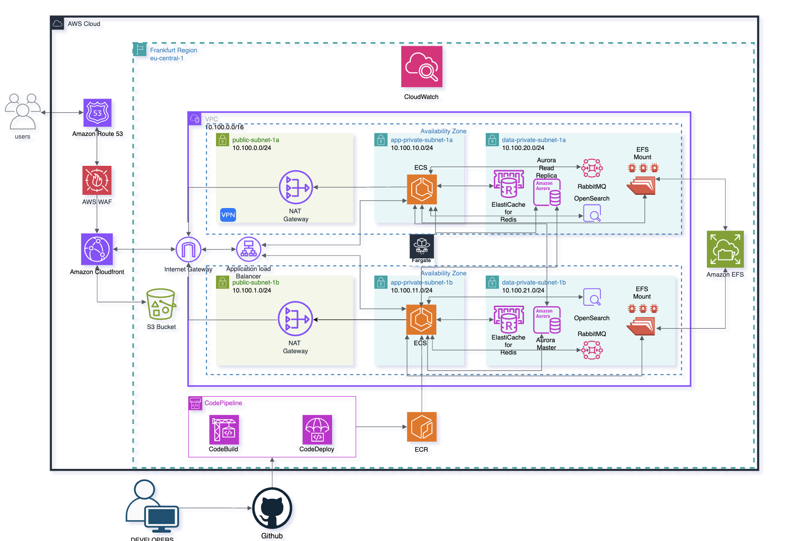

# 🍋 LimonCloud 101 - Enterprise AWS Infrastructure (Terraform)



Welcome to the **LimonCloud 101** infrastructure repository. This project contains the complete Terraform modules and configurations to provision a highly-available, secure, and scalable enterprise-grade web application architecture on AWS.

---

## 🌍 Architecture Overview

The infrastructure is built with high availability and resilience in mind. It is deployed in the **Frankfurt Region (`eu-central-1`)**, spanning across **two Availability Zones** (`eu-central-1a` and `eu-central-1b`) to ensure fault tolerance. 

The network topology strictly follows the 3-tier architecture best practices:
1. **Public Subnets**: Hosting Application Load Balancers (ALB) and NAT Gateways.
2. **Private App Subnets**: Hosting the compute layer (ECS Fargate) without direct internet access.
3. **Private Data Subnets**: Hosting stateful services (Aurora, Redis, OpenSearch, Amazon MQ) in the most isolated tier.

---

## 🧩 Terraform Modules

This repository is highly modularized, keeping code DRY and maintainable. Below is a breakdown of the core modules utilized in this project:

### 🌐 Networking & Edge Services
- **`vpc`**: Custom VPC `10.100.0.0/16` with dynamically created Public, Private, and Data subnets across two AZs. Includes Internet and NAT Gateways.
- **`route53` / `acm`**: DNS management and SSL/TLS certificate provisioning for secure HTTPS traffic (`limoncloud-101.com`).
- **`cloudfront`**: Global CDN for caching static assets and reducing latency.
- **`waf`**: AWS Web Application Firewall attached to the ALB to protect against common web exploits.
- **`vpn`**: Client VPN configuration for secure, remote access to internal resources.

### 💻 Compute & Storage
- **`ecs` (Fargate)**: Serverless compute engine for running containerized applications securely in private subnets.
- **`ecr`**: Elastic Container Registry for storing Docker images used by ECS.
- **`load-balancer`**: Application Load Balancer routing internet traffic from public subnets to ECS containers.
- **`efs`**: Elastic File System mounted across AZs for highly available, shared persistent storage.
- **`s3`**: Object storage buckets for assets and CI/CD artifacts.

### 🗄️ Databases & Stateful Services
- **`rds` (Aurora MySQL)**: Highly available relational database cluster featuring automated backups and a read replica.
- **`elasticache` (Redis)**: In-memory data store for high-performance application caching.
- **`amazon-mq` (RabbitMQ)**: Managed message broker for reliable asynchronous communication between microservices.
- **`opensearch`**: Search and analytics engine cluster for advanced querying and log management.

### 🚀 CI/CD (DevOps)
- **`codepipeline`**: Automated deployment pipelines integrating **AWS CodeBuild** (for testing/building Docker images) and **AWS CodeDeploy** (for seamless ECS deployments).

---

## 🛠️ Deployment Instructions

### Prerequisites
- [Terraform](https://www.terraform.io/downloads) (v1.0.0+)
- AWS CLI configured locally with sufficient IAM privileges.
- A GitHub repository containing your application code (for CodePipeline integration).

### Steps to Deploy

1. **Clone the Repository & Navigate to Main**
   ```bash
   git clone <your-repo-url>
   cd limoncloud-terraform-modules/main
   ```

2. **Initialize Terraform**
   Downloads the necessary AWS providers and initializes the backend.
   ```bash
   terraform init
   ```

3. **Preview Infrastructure Changes**
   Review the resources that will be created or modified.
   ```bash
   terraform plan -var="region=eu-central-1" -var="env=prod"
   ```

4. **Apply Configurations**
   Deploy the infrastructure to AWS. Type `yes` when prompted.
   ```bash
   terraform apply -var="region=eu-central-1" -var="env=prod"
   ```

---

## 🔒 Security & Best Practices

> [!WARNING]
> **State File & Secrets Management**
> This repository uses randomized passwords (via the `random_password` provider) and stores them securely in **AWS Secrets Manager**.
> 
> However, these generated passwords exist in plain-text inside the local Terraform state (`.tfstate`). **NEVER commit `.tfstate`, `.tfstate.backup`, or `*.tfvars` files to version control.** 
> The `.gitignore` file has been explicitly configured to prevent these files from being tracked.

*For collaborative environments, it is highly recommended to configure an S3 remote backend with DynamoDB state locking to ensure state file security and consistency.*
